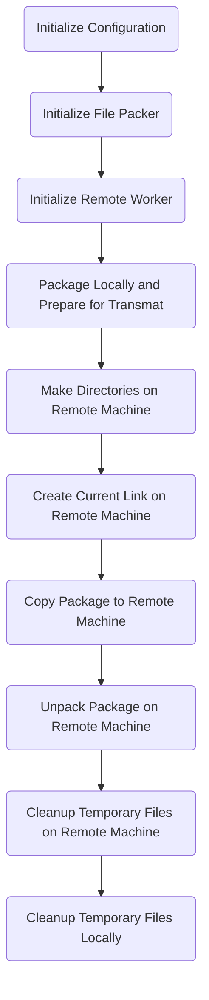
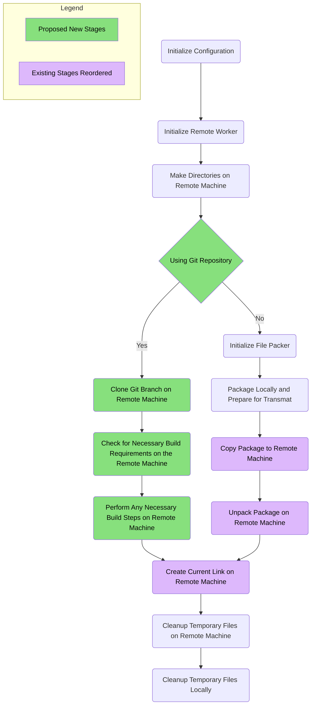

# Project Outline: Using Git as an Option for Deployment Source
This is a proposal for using git as a source of truth from which to build the
project (#6).

## Open Questions
  - [ ] How are we going to build? If we use `npm`/`yarn` on the remote machine,
        then we have to assume that the remote machine _has_ `npm`/`yarn`, or
        we have to check for it.

## Current Workflow

## Proposed New Workflow

### Proposed New Workflow Requirements

  - If `files` is defined within the `package.json`, it should behave just as it
    did in prior releases.
    - If a `branch` is defined in the `shipout` configuration, then a warning
      will be issued in debug/verbose mode and the config value will be ignored.
  - If `repository` is defined in the configuration, then the new workflow will
    be used.
    - If a `branch` is not defined in the `shipout` configuration for the given
      environment, then `main` will be used.
    - If a `branch` _is_ defined in the `shipout` configuration for the given
      environment, then that branch will be used instead.
